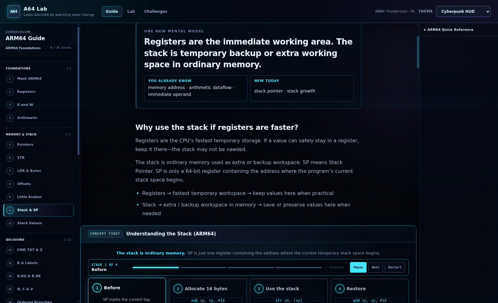
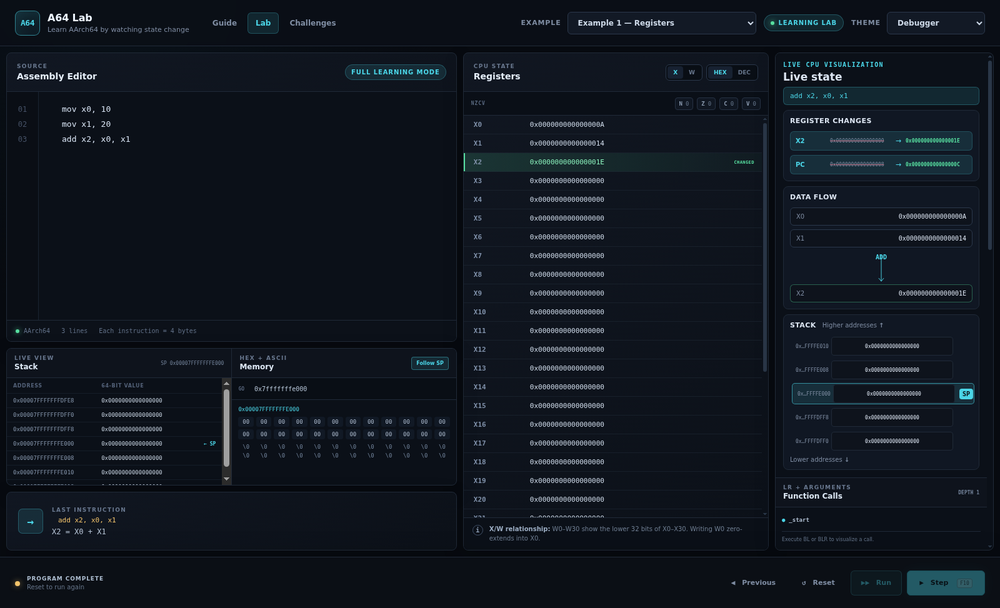

# A64 Lab

An interactive AArch64 learning platform and visual ARM64 simulator for
reverse engineering, low-level programming, and binary-exploitation
fundamentals.



A64 Lab combines a structured beginner course, prediction exercises, small
coding challenges, and a debugger-style simulator. You can learn one concept,
predict what an instruction will do, then step the same program and watch the
real simulated CPU state change.

> [!IMPORTANT]
> A64 Lab is an educational interpreter. It does not emulate a complete ARM64
> CPU, execute native machine code, inspect APKs, or attach to processes like
> GDB or LLDB.

## Three connected learning areas

| Route | Purpose |
| --- | --- |
| `/guide` | 36 focused lessons from the ARM64 mental model to native-code patterns |
| `/lab` | The full debugger-style simulator |
| `/challenges` | Prediction and code exercises checked by the real simulator engine |

Progress is stored locally in the browser. No account or backend is required.

## Learn from the beginning

The Guide assumes no assembly experience. Each lesson follows the same focused
loop:

```text
plain-language concept
        ↓
visual diagram + tiny example
        ↓
predict the result
        ↓
step a live mini-lab
        ↓
try the program in the full Lab
        ↓
check the idea and mark the lesson complete
```

The 36-lesson path deliberately separates concepts that are often taught all
at once:

| Lessons | Focus |
| --- | --- |
| 1–4 | foundations: CPU state, X registers, X/W width, and arithmetic |
| 5–11 | memory and stack: pointers, separate stores/loads, offsets, endianness, and SP |
| 12–16 | decisions: CMP/Z, unconditional flow, equality, then signed conditions |
| 17–26 | functions and frames: BL/LR, RET, arguments, results, saved LR, and frames |
| 27–31 | data and Linux: sections, string bytes, label addresses, SVC, and write |
| 32–36 | reading native code: disassembly, C mappings, debugging, and indirect flow |

Lessons are deliberately concise—usually 5–15 focused minutes—and teach the
expanded mental model before compact syntax. Each concept lesson introduces no
more than two genuinely new ideas, shows a focused Before → Execute → After
view, and ends with a bridge to the next idea. Every lesson has two focused
questions, and both must be answered correctly before completion unlocks.
Results and completion are saved locally, and finishing a lesson gives a short
reduced-motion-aware celebration.

## Live visual learning

The diagrams in the Lab and lesson mini-labs are generated from before/after
snapshots of the existing ARM64 engine. There is no second animation-only CPU.

After Step, Run, Previous, or Reset, the visual layer can show:

- register values moving from old to new;
- ADD/SUB and load/store data flow;
- SP moving through a vertical stack;
- stack bytes and paired FP/LR saves changing;
- registers pointing to `.data`, strings, code, or stack memory;
- NZCV state and whether a conditional branch was taken;
- BL updating PC and X30/LR;
- nested call-stack growth and RET returning to the caller.

Animations last only a few hundred milliseconds and respect reduced-motion
preferences.



## Simulator highlights

- X0–X30, W0–W30, SP, PC, FP/LR aliases, and NZCV flags
- Correct W-register zero-extension into its paired X register
- Step, Run, Reset, and complete-state Previous
- Register, flag, stack, and memory change highlighting
- Sparse byte-addressable, little-endian memory
- Stack and hex/ASCII memory viewers
- Clickable pointer hints that navigate to memory
- Labels, conditional branches, BL/RET, BR/BLR, and a call-stack panel
- GNU-style `.text`, `.data`, strings, symbols, and `ldr xN, =label`
- Simplified Linux AArch64 `write` and `exit` syscalls
- Terminal output, five built-in examples, and three saved visual themes
- A React-independent TypeScript simulation engine

## Quick start

Requires Node.js 22.12 or newer.

```bash
git clone https://github.com/worldtreeboy/a64-lab.git
cd a64-lab
npm install
npm run dev
```

Open the URL printed by Vite. The Guide is the starting page; `/lab` opens the
simulator directly.

For the Electron development wrapper:

```bash
npm run electron:dev
```

## Try a Linux write syscall

This GNU-style source runs unchanged:

```asm
.section .data
message:
    .asciz "shellcode"

.section .text
.globl _start

_start:
    mov x0, 1
    ldr x1, =message
    mov x2, 9
    mov x8, 64
    svc 0

    mov x0, 0
    mov x8, 93
    svc 0
```

The terminal displays `shellcode`, then reports exit status `0`.

> `write` reads exactly X2 bytes. It does not stop at the NULL byte added by
> `.asciz`. If you change the text, update X2 to its UTF-8 byte length.

## Supported educational subset

| Category | Instructions |
| --- | --- |
| Data movement | `MOV`, `LDR`, `STR`, `LDRB`, `STRB`, `LDP`, `STP` |
| Arithmetic | `ADD`, `SUB` |
| Comparison | `CMP`, `TST` |
| Branching | `B`, `BL`, `BR`, `BLR`, `RET` |
| Conditions | `B.EQ`, `B.NE`, `B.GT`, `B.LT`, `B.GE`, `B.LE` |
| Syscalls | `SVC` |

Memory operands include offsets and pre/post-index writeback:

```asm
ldr x0, [x1, #8]
str x0, [sp, #16]
stp x29, x30, [sp, #-16]!
ldp x29, x30, [sp], #16
```

The parser accepts these common GNU directives and forms:

```asm
.section .data
.data
.section .text
.text
.ascii "no automatic NULL"
.asciz "NULL terminated\n"
.globl _start
.global _start
ldr x1, =message
```

Supported string escapes are `\n`, `\r`, `\t`, `\\`, `\"`, and `\0`.
Directives and labels do not consume instruction addresses. If a text symbol
named `_start` exists, execution and Reset begin there.

## Educational memory model

| Region | Base address | Behavior |
| --- | ---: | --- |
| `.text` | `0x00000000` | Each simulated instruction occupies four bytes |
| `.data` | `0x00400000` | Strings are allocated sequentially and restored on Reset |
| Stack | `0x7FFFFFFFE000` | Sparse memory grows downward by convention |

Addresses and X-register values use `bigint`, so 64-bit precision is never
silently lost.

## Engine API

The engine under `src/arm64` has no React, browser, or Electron dependency:

```ts
import { ARM64CPU } from './src/arm64/interpreter';

const cpu = new ARM64CPU();

cpu.loadProgram(`
  mov x0, 10
  mov x1, 20
  add x2, x0, x1
`);

cpu.step();
console.log(cpu.registers.x0); // 10n
```

Guide mini-labs, challenges, and the full Lab all use this same engine.

## Project structure

```text
src/
  arm64/                 parser, registers, memory, CPU, instructions
  components/
    learning/            lessons, quizzes, examples, embedded mini-labs
    visualization/       snapshot-derived animated diagrams
  learning/              lesson/challenge data and local progress
  pages/                 Guide and Challenges routes
  examples/              built-in Lab programs
  App.tsx                 existing full simulator at /lab
  RouterApp.tsx           browser/Electron routing shell
electron/                 desktop entry and runtime smoke checks
```

The parser and CPU own instruction semantics. React consumes immutable
snapshots and step results, keeping presentation separate from execution.

## Validation

```bash
npm test
npm run typecheck
npm run build
npm run browser:smoke
npm run electron:smoke
npm run learning:smoke
```

`npm run build` creates a browser build with refresh-safe nested route assets.
`npm run build:electron` creates the relative-asset build used with `file://`.

The automated suite covers the original CPU behavior plus lesson programs,
multi-question completion gating, retries and answer reveals, progress
persistence, routes, Guide-to-Lab transfer, semantic challenge verification,
live forward/back visual transitions, responsive layout, direct-route
refreshes, and Electron rendering.

## Deliberate simplifications

A64 Lab has no instruction decoder, MMU, exception levels, pipeline, device
model, host syscall access, or complete AArch64 instruction set. It teaches a
small practical subset clearly before you move to real native tools and
binaries.

## License

Released under the [MIT License](LICENSE).
